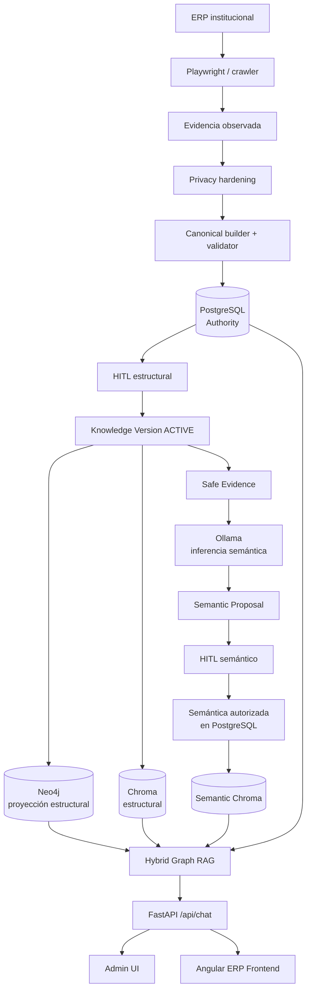

<div align="center">

# 🚒 Chat-CBMM vNext

### Asistente conversacional gobernado para ERP institucional

**Conocimiento verificable · Human-in-the-Loop · Hybrid Graph RAG · Fail-closed**


**Release Candidate:** `vnext-post-privacy-m3-rc1-20260825`

</div>

---

## 📌 Contenido

- [¿Qué es Chat-CBMM?](#-qué-es-chat-cbmm)
- [Principios de diseño](#-principios-de-diseño)
- [Arquitectura](#-arquitectura)
- [Capas funcionales: M1, M2 y M3](#-capas-funcionales-m1-m2-y-m3)
- [Estado certificado del RC1](#-estado-certificado-del-rc1)
- [Privacidad y límites de confianza](#-privacidad-y-límites-de-confianza)
- [Admin UI y frontend Angular](#-admin-ui-y-frontend-angular)
- [Puesta en marcha](#-puesta-en-marcha)
- [Pruebas y certificación](#-pruebas-y-certificación)
- [Estructura del repositorio](#-estructura-del-repositorio)
- [Limitaciones actuales](#-limitaciones-actuales)
- [Roadmap](#-roadmap)
- [Hitos y tags](#-hitos-y-tags)

---

## ✨ ¿Qué es Chat-CBMM?

**Chat-CBMM vNext** es una plataforma de conocimiento gobernado para orientar a usuarios dentro de un ERP institucional. Su interfaz final es conversacional, pero el sistema no está diseñado como un “chatbot que sabe cosas” ni como un LLM conectado directamente al ERP.

Su función es construir, revisar, publicar y consultar conocimiento verificable sobre el sistema, manteniendo separadas la **evidencia observada**, la **autoridad del conocimiento**, las **proyecciones de búsqueda** y la **generación lingüística**.

El asistente puede responder preguntas como:

- **¿Dónde configuro los años?**
- **¿Para qué sirve esta pantalla?**
- **¿Dónde está el botón Buscar?**
- **¿Cómo busco por RUC aquí?**
- **¿Qué columnas tiene esta tabla?**
- **¿Cómo avanzo a la siguiente página?**
- **¿Cómo creo un nuevo año aquí?**

Si no existe evidencia gobernada suficiente, el sistema **se abstiene** en lugar de completar la respuesta con conocimiento no autorizado.

> **Idea central:** determinismo en los límites de confianza; LLM en los límites de incertidumbre lingüística.

---

## 🎯 Objetivo

Construir un asistente ERP que sea útil sin convertir al modelo generativo en fuente de verdad.

El diseño busca que:

- ✅ el conocimiento autorizado tenga trazabilidad;
- ✅ PostgreSQL conserve la autoridad;
- ✅ Neo4j y Chroma sean proyecciones reconstruibles;
- ✅ la semántica generada pase por revisión humana;
- ✅ el crawler explore sin ejecutar mutaciones inseguras;
- ✅ la conversación mantenga contexto sin inventar autoridad;
- ✅ las preguntas fuera de dominio fallen de forma segura;
- ✅ las respuestas puedan explicar de dónde proviene la información.

---

## 🧱 Principios de diseño

### 🗃️ PostgreSQL es la fuente de verdad

El estado autorizado del conocimiento estructural y semántico reside en PostgreSQL. Las decisiones de revisión, corrección, promoción y publicación se gobiernan desde esta capa.

### 🕸️ Neo4j es una proyección estructural

Neo4j representa relaciones navegables entre módulos, pantallas, estados, controles, campos, eventos y transiciones. No decide qué conocimiento es válido: puede reconstruirse desde la autoridad en PostgreSQL.

### 🔎 ChromaDB es una proyección vectorial

Chroma contiene documentos seguros e indexables para recuperación densa. La similitud vectorial ayuda a recuperar candidatos, pero **no concede autoridad**.

### 🧠 El LLM propone; no gobierna

Ollama se utiliza en los puntos donde existe incertidumbre lingüística, por ejemplo para inferencia semántica. Una propuesta generada no se convierte automáticamente en conocimiento publicable.

### 👨‍⚖️ Human-in-the-Loop en los límites de confianza

Las propuestas semánticas pueden ser aprobadas, corregidas o rechazadas. La revisión humana queda registrada y la proyección semántica solo publica contenido que continúa siendo válido.

### 🔒 Fail-closed por defecto

Cuando la evidencia disponible no permite sostener una respuesta, el asistente responde con abstención.

### 🧩 Separación explícita de responsabilidades

En este proyecto:

- descubrir **no** significa aprobar;
- observar **no** significa publicar;
- RAW **no** significa conocimiento autorizado;
- un candidato de retrieval **no** significa evidencia;
- ranking **no** significa autoridad;
- Neo4j/Chroma **no** son fuente de verdad;
- una propuesta del LLM **no** es verdad;
- el LLM **no** controla Playwright;
- el cliente **no** define la autoridad del backend.

---

## 🏗️ Arquitectura



### Componentes principales

| Componente               | Función                                                                    |
| ------------------------ | -------------------------------------------------------------------------- |
| **PostgreSQL**           | Autoridad del conocimiento, versiones, revisiones, lifecycle y publicación |
| **Neo4j**                | Proyección estructural para relaciones y expansión de grafo                |
| **ChromaDB estructural** | Recuperación vectorial del conocimiento estructural autorizado             |
| **Semantic Chroma**      | Recuperación de semántica revisada y publicable                            |
| **Ollama**               | Embeddings e inferencia generativa restringida                             |
| **Playwright / crawler** | Exploración controlada del ERP y captura de evidencia                      |
| **FastAPI**              | API operacional y conversacional                                           |
| **Admin UI**             | Gobierno, revisión, publicación, observabilidad y jobs                     |
| **Angular Frontend**     | Integración del asistente dentro del ERP institucional                     |

---

## 🧠 Capas funcionales: M1, M2 y M3

### M1 — Conocimiento estructural gobernado

M1 transforma la observación del ERP en conocimiento estructural autorizado.

Flujo conceptual:

```text
ERP
  ↓
Playwright / crawler
  ↓
Evidencia
  ↓
Privacy hardening
  ↓
Canonical
  ↓
Validación
  ↓
PostgreSQL STAGING
  ↓
HITL estructural
  ↓
ACTIVE
  ↓
Neo4j + Chroma estructural
```

Entre las entidades estructurales se incluyen:

- ERP system;
- módulos y submódulos;
- pantallas;
- estados de UI;
- campos;
- controles;
- tablas y columnas;
- enlaces;
- eventos;
- transiciones;
- evidencias.

### M2 — Semántica gobernada con HITL

M2 añade significado funcional sin otorgar autoridad automática a un modelo generativo.

Flujo:

1. Se parte de una pantalla estructural ACTIVE.
2. `ScreenEvidenceBuilder` construye evidencia segura.
3. La pantalla debe pasar la evaluación de elegibilidad semántica.
4. El lifecycle decide si corresponde `GENERATED`, `CARRIED_FORWARD`, `REINFERRED` o bloqueo.
5. Ollama produce una propuesta estructurada bajo grounding.
6. La propuesta queda `pending_review`.
7. Un operador puede aprobar, corregir o rechazar.
8. Solo una propuesta publicable puede entrar en Semantic Chroma.

> **Cobertura certificada en RC1:** el vertical slice demostrado es `SCREEN_PURPOSE`. La pantalla **Año** tiene una propuesta corregida por HITL y publicada. Esto **no** implica cobertura semántica completa de las 52 pantallas.

### M3 — Hybrid Graph RAG conversacional

M3 integra recuperación léxica, densa, semántica y de grafo con validación contra la autoridad.

La ruta conversacional incluye, de forma resumida:

```text
Pregunta
  ↓
Conversation Context
  ↓
Query Planner
  ↓
Canonical Entity Resolver
  ↓
PG lexical/full-text/trigram + Chroma structural + Semantic Chroma
  ↓
RRF rank fusion
  ↓
Validación PostgreSQL
  ↓
Expansión Neo4j
  ↓
Revalidación PostgreSQL
  ↓
Evidence Selector
  ↓
Answer Decision
  ↓
Respuesta / Clarification / Abstention
```

Intenciones soportadas en la matriz M3:

| Intent             | Propósito                                                |
| ------------------ | -------------------------------------------------------- |
| `LOCATE_SCREEN`    | Localizar una pantalla                                   |
| `LOCATE_FIELD`     | Localizar un campo                                       |
| `SCREEN_PURPOSE`   | Explicar el propósito autorizado de una pantalla         |
| `LIST_FIELDS`      | Listar campos disponibles                                |
| `SEARCH_BY_FIELD`  | Orientar una búsqueda usando un campo                    |
| `FIND_CONTROL`     | Localizar un control                                     |
| `LIST_COLUMNS`     | Listar columnas de una tabla                             |
| `NAVIGATION_EVENT` | Orientar navegación mediante eventos conocidos           |
| `MUTATIVE_ACTION`  | Guiar una acción mutativa sin ejecutarla automáticamente |

---

## ✅ Estado certificado del RC1

### 🏷️ Release Candidate

| Artefacto          | Valor                                      |
| ------------------ | ------------------------------------------ |
| **Tag compartido** | `vnext-post-privacy-m3-rc1-20260825`       |
| **Backend branch** | `feat/vnext-generic-bootstrap`             |
| **Backend commit** | `7d5582fb09f48809639e7893fe7c9f230f758662` |
| **Angular branch** | `feat/erp-assistant-chat`                  |
| **Angular commit** | `f6af9b2600a9b6a70dbf19eb6bf91f2ab904ada8` |

### 🗃️ Knowledge Authority

| Métrica                  |                RC1 |
| ------------------------ | -----------------: |
| ACTIVE knowledge version | `bc4fc5135e34f92e` |
| Knowledge items          |           **1867** |
| Approved                 |           **1867** |
| Pending                  |              **0** |
| Rejected                 |              **0** |

Distribución estructural ACTIVE:

| Tipo         | Cantidad |
| ------------ | -------: |
| ERP System   |        1 |
| Module       |       12 |
| Screen       |       52 |
| UI State     |      111 |
| Field        |       29 |
| Control      |      619 |
| Table        |       46 |
| Table Column |      217 |
| Link         |      506 |
| Event        |       79 |
| Transition   |       79 |
| Evidence     |      116 |
| **Total**    | **1867** |

### 🕸️ Neo4j estructural

| Métrica           |                RC1 |
| ----------------- | -----------------: |
| Nodos             |           **1867** |
| Relaciones        |           **2550** |
| Knowledge version | `bc4fc5135e34f92e` |

La proyección física fue certificada contra el plan gobernado de PostgreSQL.

### 🔎 Chroma estructural

| Métrica              |                          RC1 |
| -------------------- | ---------------------------: |
| Colección            | `erp_assistant_knowledge_v1` |
| Documentos           |                     **1705** |
| Embedding model      |       `qwen3-embedding:0.6b` |
| Dimensiones          |                     **1024** |
| Omitidos controlados |                      **162** |

Los 162 omitidos corresponden a `missing_safe_label` y no representan documentos parcialmente indexados.

### 🧠 Semántica gobernada

| Campo                | RC1              |
| -------------------- | ---------------- |
| Pantalla certificada | **Año**          |
| Semantic type        | `screen_purpose` |
| Estado HITL          | `corrected`      |
| Review revision      | `1`              |
| Lifecycle origin     | `generated`      |
| Generation model     | `llama3.2:3b`    |
| Capabilities         | `2`              |

Propósito efectivo certificado:

> Permite visualizar la información disponible en la pantalla Año y navegar entre las páginas de resultados.

### 🧬 Semantic Chroma

| Métrica                |                         RC1 |
| ---------------------- | --------------------------: |
| Colección              | `erp_assistant_semantic_v1` |
| Documentos publicables |                       **1** |
| Embedding model        |      `qwen3-embedding:0.6b` |
| Dimensiones            |                    **1024** |

### 💬 M3 conversacional

| Métrica   | Antes del batching |            RC1 |
| --------- | -----------------: | -------------: |
| Matriz    |              26/26 |      **26/26** |
| Pass rate |              100 % |      **100 %** |
| Mean      |          969.90 ms |  **650.01 ms** |
| p50       |          917.70 ms |  **638.17 ms** |
| p95       |         1350.86 ms | **1002.98 ms** |
| Max       |         3468.82 ms | **1869.97 ms** |

La optimización del hot path redujo las consultas SQL observadas en una consulta representativa de:

```text
233 → 13 consultas
```

sin eliminar las validaciones de autoridad ni alterar el resultado funcional de la matriz M3.

---

## 🔐 Privacidad y límites de confianza

El RC1 incluye privacy hardening en la frontera pre-canonical.

### Política de persistencia

Por defecto:

- no se persiste HTML durable;
- no se persisten screenshots durables;
- los payloads JSON pre-canonical pasan por sanitización;
- `visible_text` y otros campos sensibles no se conservan como evidencia durable sin control.

La auditoría del crawl post-hardening verificó:

- **69 rutas** evaluadas;
- **52 pantallas funcionales**;
- **17 rutas no disponibles**;
- **111 estados UI**;
- **79 transiciones**;
- **586 Network Evidence** agregadas/distintas;
- **276 artefactos pre-canonical persistidos**, todos JSON;
- **0 violaciones** en la auditoría de artefactos;
- **0 HTML/screenshots durables**.

Herramienta de auditoría:

```bash
python -m scripts.audit.audit_artifact_privacy --help
```

### Trust boundaries

Las capas externas de recuperación no sustituyen la autoridad:

```text
Chroma candidate
      ↓
PostgreSQL validation
      ↓
Neo4j expansion
      ↓
PostgreSQL revalidation
      ↓
Evidence selection
      ↓
Answer decision
```

La semántica recuperada también se vuelve a autorizar frente a PostgreSQL y Safe Evidence antes de usarse como evidencia efectiva.

---

## 🧰 Admin UI y frontend Angular

### Admin UI

`admin-ui/` contiene una consola React + TypeScript + Vite conectable al backend real.

Funciones disponibles en el RC1:

- 📊 estado operativo del sistema;
- 🧭 pipeline y jobs;
- 📦 publicación y promoción de versiones;
- 🧱 revisión estructural;
- 🧠 inferencia semántica;
- 👨‍⚖️ HITL semántico;
- 🕸️ sincronización Neo4j;
- 🔎 sincronización Chroma estructural;
- 🧬 sincronización Semantic Chroma.

Para conectar la Admin UI al backend durante desarrollo:

```env
# admin-ui/.env.local
VITE_ADMIN_API_TARGET=http://127.0.0.1:8000
```

> La identidad de revisor disponible en esta etapa es provisional y no equivale a un sistema completo de autenticación/RBAC.

### Angular ERP Frontend

El frontend institucional se mantiene en un repositorio separado.

RC certificado:

```text
branch: feat/erp-assistant-chat
commit: f6af9b2600a9b6a70dbf19eb6bf91f2ab904ada8
tag:    vnext-post-privacy-m3-rc1-20260825
```

El smoke test de extremo a extremo verificó:

- ✅ respuesta estructural;
- ✅ continuidad mediante `conversationId`;
- ✅ respuesta semántica HITL;
- ✅ abstención fuera de dominio;
- ✅ navegación desde una fuente hacia `/admin/general/anios`.

---

## ⚙️ Requisitos

### Backend

- Python **>= 3.11**
- entorno virtual Python
- Docker + Docker Compose
- PostgreSQL 17 en el entorno certificado
- Neo4j
- ChromaDB
- Ollama accesible desde el backend

### Interfaces web

- Node.js + npm
- Admin UI: React 19 + Vite
- Frontend institucional: Angular 18

### Ollama remoto

El runtime también fue certificado con Ollama ejecutándose en otra máquina a través de Tailscale.

Modelos del RC1:

```text
Embeddings: qwen3-embedding:0.6b  (1024 dimensiones)
Generation: llama3.2:3b
```

No es obligatorio usar Tailscale: `ERP_ASSISTANT_OLLAMA_URL` puede apuntar a un Ollama local o a un host accesible por red.

---

## 🔐 Configuración

El proyecto utiliza variables de entorno para credenciales, endpoints y flags operativos. **No subir `.env` al repositorio.**

Variables relevantes:

```env
ERP_ASSISTANT_SEMANTIC_REVIEW_API=1
ERP_ASSISTANT_CRAWL_PROFILE=configs/cbmm.yaml

ERP_ASSISTANT_OLLAMA_URL=http://OLLAMA_HOST:11434
ERP_ASSISTANT_EMBEDDING_MODEL=qwen3-embedding:0.6b
ERP_ASSISTANT_GENERATION_MODEL=llama3.2:3b
```

Las credenciales de PostgreSQL, Neo4j, ERP y cualquier proveedor externo deben mantenerse únicamente en configuración local segura.

---

## 🚀 Puesta en marcha

### 1. Backend

```bash
cd ~/Desktop/aprendizaje-chtb-cbmm
source .venv/bin/activate
```

### 2. PostgreSQL

```bash
docker compose --env-file .env \
  -f docker-compose.postgres.yml up -d
```

### 3. Neo4j

```bash
docker compose --env-file .env up -d
```

> Los dos compose files pueden reportar servicios “orphan” del otro stack. No usar `--remove-orphans` de forma automática, porque podría detener servicios que pertenecen al otro compose.

### 4. Estado de PostgreSQL y Neo4j

```bash
python -m dotenv run -- \
python -m scripts.status.database_status

python -m dotenv run -- \
python -m scripts.status.neo4j_status
```

### 5. API

```bash
python -m dotenv run -- \
python -m scripts.runtime.run_api
```

API local:

```text
http://127.0.0.1:8000
```

### 6. Admin UI

```bash
cd admin-ui
npm install
npm run dev
```

Vite suele exponer la consola en:

```text
http://localhost:5173
```

### 7. Angular institucional

En el repositorio Angular:

```bash
cd ~/Desktop/SiaCat/siacat_frontend
npm install
npm run start:local
```

El perfil `local` usa `/api` y el proxy de desarrollo apunta al backend local.

```text
http://localhost:4200
```

---

## 🧪 Pruebas y certificación

### Suite completa

```bash
pytest -q
```

### Integridad de bytecode

```bash
python -m compileall -q src scripts
```

### Matriz M3 conversacional

```bash
python -m dotenv run -- \
python -m scripts.certification.run_m3_9_conversational_matrix \
  --output ~/Downloads/m3-report.json
```

Resultado certificado para RC1:

```text
turns=26
passed=26
failed=0
```

### Dry-run de Chroma estructural

```bash
python -m dotenv run -- \
python -m scripts.pipeline.sync_approved_to_chroma \
  --knowledge-version bc4fc5135e34f92e \
  --dry-run \
  --pretty
```

El dry-run certificado produjo:

```text
eligible_items: 1867
documents: 1705
skipped: 162
collection: erp_assistant_knowledge_v1
```

---

## 🗂️ Estructura del repositorio

```text
.
├── admin-ui/                  # Consola React/Vite de administración
├── configs/                   # Perfiles del ERP y políticas
├── data/                      # Artefactos y persistencias locales
├── scripts/                   # Entry points y herramientas CLI
│   ├── runtime/               # Arranque de procesos
│   ├── pipeline/              # Operaciones manuales M1/M2
│   ├── status/                # Estado de infraestructura
│   ├── inspect/               # Inspección y diagnóstico
│   ├── audit/                 # Auditoría y validación
│   ├── tools/                 # Consultas y utilidades manuales
│   ├── operations/            # Bootstrap/operación de infraestructura
│   ├── certification/         # Matrices y certificación
│   └── common/                # Helpers exclusivos de CLI
├── src/
│   ├── analysis/              # Safe Evidence, elegibilidad, prompts, generación
│   ├── api/                   # FastAPI y contratos HTTP
│   ├── database/              # Modelos, repositorios, servicios y lifecycle
│   ├── hybrid/                # Hybrid Graph RAG
│   ├── knowledge/             # Crawl, canonicalización, validación y privacidad
│   ├── pipeline/              # Ejecutores de PipelineJob
│   └── vectorstore/           # Chroma y clientes Ollama
├── tests/                     # Suite automatizada por dominio
│   ├── api/                   # Contratos HTTP/FastAPI
│   ├── config/                # Settings y perfiles
│   ├── crawler/               # Crawling, eventos, estados y evidencia
│   ├── canonical/             # Conocimiento canónico
│   ├── database/              # Modelos/migraciones PostgreSQL
│   ├── governance/            # Revisión, promoción y reconciliación
│   ├── hybrid/                # M3 / Hybrid Graph RAG
│   ├── pipeline/              # Jobs, runner y executors
│   ├── projections/           # Neo4j / Chroma
│   ├── semantic/              # Inferencia y lifecycle semántico
│   ├── scripts/               # Herramientas CLI
│   ├── architecture/          # Fronteras y generalización
│   └── fixtures/              # Fixtures compartidos
├── docker-compose.postgres.yml
├── docker-compose.yml
├── pyproject.toml
└── README.md
```

---

## 💬 Qué puede hacer hoy el asistente

En el RC1, la arquitectura conversacional puede:

- localizar pantallas;
- localizar campos;
- listar campos;
- listar columnas;
- localizar controles;
- orientar búsquedas por campo;
- orientar eventos de navegación;
- explicar propósito de pantalla cuando existe semántica autorizada;
- mantener referencias conversacionales entre turnos;
- ofrecer guía para acciones mutativas sin ejecutarlas;
- abstenerse cuando la evidencia no es suficiente.

Ejemplo certificado:

```text
Usuario: ¿Dónde configuro los años?
Asistente: La pantalla "Año" está dentro del módulo "General".

Usuario: ¿Y para qué sirve?
Asistente: Permite visualizar la información disponible en la pantalla Año
           y navegar entre las páginas de resultados.

Usuario: ¿Cuál es la capital de Francia?
Asistente: No encontré conocimiento validado suficiente para responder esa pregunta.
```

---

## ⚠️ Limitaciones actuales

Este RC es funcional y está certificado internamente, pero no debe interpretarse como una versión final de producción.

- La semántica HITL certificada cubre actualmente el vertical `SCREEN_PURPOSE` para **Año**, no todas las pantallas.
- La identidad `reviewer_id`/revisor de Admin UI es provisional; todavía no representa autenticación y RBAC de producción.
- El asistente orienta; **no ejecuta transacciones ERP**.
- Chroma y Neo4j son proyecciones y nunca deben tratarse como autoridad independiente.
- La matriz M3 de 26 turnos es una regresión de ingeniería, no una evaluación científica completa.
- Falta la evaluación científica con Gold Standard, métricas formales y evaluación de usabilidad.
- La configuración de dependencias y despliegue todavía requiere endurecimiento para una distribución productiva reproducible.

---

## 🛣️ Roadmap

Después del RC1, las líneas de trabajo principales son:

1. 📚 sincronizar documentación técnica y contexto maestro con el RC1;
2. 📘 actualizar el manual completo del proyecto;
3. 🧪 preparar evaluación científica con Gold Standard y baseline congelado;
4. 📄 alinear el artículo científico con el sistema real;
5. 🧠 ampliar semántica gobernada más allá del vertical `SCREEN_PURPOSE` certificado;
6. 🔐 diseñar identidad confiable, autenticación y RBAC para operación real;
7. 📦 endurecer instalación, dependencias, deployment y runbook;
8. 👥 preparar UAT y validación institucional.

---

## 🏷️ Hitos y tags

| Tag                                  | Significado                                        |
| ------------------------------------ | -------------------------------------------------- |
| `assistant-mvp-v0.1.0`               | Hito histórico del asistente MVP                   |
| `canonical-knowledge-v0.1.0`         | Hito histórico de conocimiento canonical           |
| `vnext-m1-m2-freeze-20260821`        | Freeze histórico de M1/M2                          |
| `vnext-m3-freeze-20260822`           | Freeze histórico de M3                             |
| `vnext-post-privacy-m3-rc1-20260825` | **RC1 actual post-privacy + M2/M3 recertificados** |

Los freezes históricos no deben moverse. El RC1 representa un estado posterior con privacy hardening, nueva ACTIVE, proyecciones reconstruidas y optimización del hot path.

---

## 🤝 Estado del proyecto

> **RC interno funcionalmente certificado.**

Backend, autoridad PostgreSQL, proyecciones Neo4j/Chroma, semántica HITL, Hybrid Graph RAG, API, Admin UI y frontend Angular fueron validados de extremo a extremo para el tag:

```text
vnext-post-privacy-m3-rc1-20260825
```

---

## 📜 Licencia

La licencia de distribución/uso del proyecto debe definirse de acuerdo con la política institucional correspondiente antes de una publicación externa.

---

## 🙌 Créditos

Proyecto de investigación, prototipado e ingeniería orientado a un asistente ERP gobernado para CBMM, integrando:

- construcción de conocimiento desde evidencia;
- privacidad en fronteras pre-canonical;
- autoridad y HITL en PostgreSQL;
- proyecciones reconstruibles en Neo4j y ChromaDB;
- semántica gobernada;
- Hybrid Graph RAG;
- integración con Admin UI y ERP Angular.

<div align="center">

**Chat-CBMM vNext — conocimiento antes que improvisación.**

</div>
